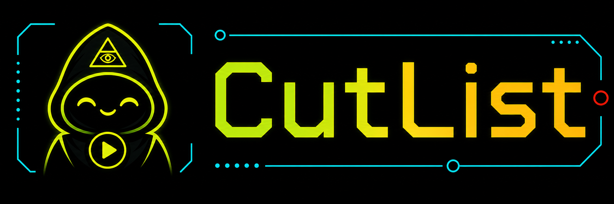

# The CutList



The CutList is a Tauri desktop app with a Next.js TypeScript UI for verified collaborative playlist curation. It uses an LLM for taste, interpretation, and candidate suggestions, then relies on provider metadata, Zod validation, and deterministic constraints before anything enters the accepted playlist.

Created by [Will Bridewell](https://github.com/wbridewell).

The hooded mascot in the logo is The Curator, the visual face of the app's playlist-guidance voice.

## Status

Early desktop prototype. Suitable for local development, experimentation, and review. It is not a production multi-user service.

## What It Solves

LLMs are useful for playlist taste and sequencing, but they hallucinate track details. The CutList separates taste from verification: the model proposes, metadata providers verify, constraints enforce, and the desktop app stores the local draft.

The larger product hypothesis is that playlist builders need an AI collaborator that behaves more like a music editor than a recommendation engine: good at flow, repair, constraints, and explanation, while still leaving the user in control of the final sequence.

## Features

- Trusted desktop-backend LLM calls only, with local Ollama for development and optional OpenAI or Gemini.
- Zod validation for requests, model output, and playlist state.
- iTunes and MusicBrainz-backed verification before tracks enter the accepted playlist.
- Runtime, duplicate, artist, genre, explicit-content, BPM, vocalist-profile, and energy-trajectory constraint handling, including unknown-evidence warnings where provider metadata is incomplete.
- CSV, TXT, JSON, migration CSV, M3U/M3U8, and Apple Music XML export.
- Import-from-chat and critique routes.
- Deterministic no-LLM mode for testing and constrained workflows.

No Spotify auth, Apple Music auth, accounts, vector database, persistent server database, or playlist auto-upload are included.

## Architecture Summary

- UI: `src/app/page.tsx` and `src/components`.
- Desktop command bridge: `src/lib/desktop` plus `desktop/command.ts`.
- LLM services: `src/lib/ai`, with services, prompts, contracts, provider clients, and testing helpers split into focused subdirectories.
- Metadata verification: `src/lib/music`.
- Playlist domain logic: `src/lib/playlist`, with constraints, IO, analysis, and fixtures split into focused subdirectories.
- Client native-command helpers: `src/lib/client`.

The core rule is: the LLM proposes, providers verify, constraints enforce, and the desktop app persists the local draft.

## Quick Start

Desktop development is the normal path for this repo. It requires:

- Node.js and npm
- Rust toolchain
- Tauri prerequisites for your OS

If you only want to iterate on the embedded Next.js UI, `npm run next:dev` starts the web UI without the desktop shell.

```bash
npm install
npm run dev
```

`npm run dev` launches the Tauri desktop app and starts the embedded Next UI development server.

## Configuration

The default development provider is Ollama, so OpenAI tokens are not required for local generation, extraction, or critique.

```bash
ollama pull granite4.1:8b
```

Then set:

```bash
LLM_PROVIDER=ollama
OLLAMA_BASE_URL=http://localhost:11434
OLLAMA_MODEL=granite4.1:8b
```

To use OpenAI instead:

```bash
LLM_PROVIDER=openai
OPENAI_API_KEY=
OPENAI_MODEL=gpt-4.1-mini
```

To use Gemini:

```bash
LLM_PROVIDER=gemini
GEMINI_API_KEY=
GEMINI_MODEL=gemini-2.5-flash
```

For deterministic testing:

```bash
LLM_PROVIDER=none
```

See `.env.example` for the full environment list. Do not prefix private keys with `NEXT_PUBLIC_`.
The normal setup path is the in-app `LLM setup` dialog; environment variables remain useful as development/debug overrides.

## Development

```bash
npm run dev
npm run next:dev
npm run lint
npm run typecheck
npm run test
npm run build
npm run build:dmg
```

`npm run dev` starts the full Tauri desktop app.
`npm run next:dev` starts only the embedded Next.js UI.
`npm run build` builds the static frontend used by the desktop app.
`npm run build:dmg` builds the macOS release DMG and bundled desktop runtime. It uses the bundled portable Node when available; set `CUTLIST_NODE_RUNTIME_PATH` only when you need to provide a different standalone macOS Node binary.

`npm run lint` currently aliases the TypeScript check because this prototype has not added an ESLint configuration yet.

## Testing

Vitest covers playlist logic, API helpers, LLM/provider error handling, imports, exports, constraints, and selected UI behavior.

```bash
npm test
```

## Security Notes

- LLM and provider calls stay in the trusted desktop backend.
- Desktop command payloads are schema-validated.
- API/provider keys are stored locally on the machine, not in UI state.
- Native app-data drafts and sessions are convenience storage, not secure secrets storage.

Report vulnerabilities privately. See [SECURITY.md](SECURITY.md).

## Documentation

- [Alpha test guide](docs/ALPHA_TEST_GUIDE.md)
- [First-run alpha](docs/FIRST_RUN_ALPHA.md)
- [Usage](docs/USAGE.md)
- [Product strategy](docs/PRODUCT_STRATEGY.md)
- [Architecture](docs/ARCHITECTURE.md)
- [Tech stack](docs/TECH_STACK.md)
- [Design](docs/DESIGN.md)
- [Security implementation notes](docs/SECURITY.md)
- [Development](docs/DEVELOPMENT.md)
- [AI agent orientation](AGENTS.md)

## Known Limitations

- No authentication or authorization.
- No server-side database.
- No OS keychain integration yet.
- No streaming-service upload.
- Provider metadata can still be ambiguous.

## Contributing

See [CONTRIBUTING.md](CONTRIBUTING.md). Keep changes scoped, update docs when assumptions change, and avoid new dependencies without a clear reason.

## License

MIT. See [LICENSE](LICENSE).

The CutList name and logo are project branding and are not licensed for confusing use in unrelated products.
